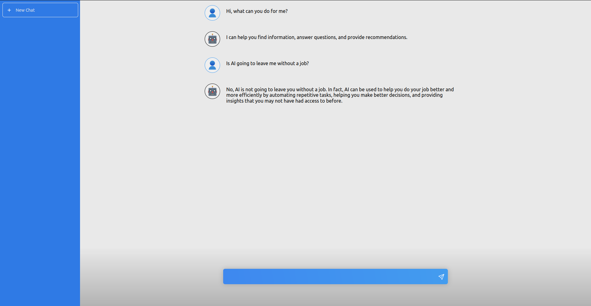

# Modern ChatGPT

Modern ChatGPT is a user-friendly web application built using React that allows users to have interactive conversations with an AI language model. This project is currently under development, and contributions are welcome.

> :warning: **Expect bugs**: This project is under active development and may contain bugs!

<a href="https://moden-chat-gpt.netlify.app/" target="_blank" rel="noopener noreferrer"><a/>

Click up here 👆

## Table of Contents

- [Features](#features)
- [Installation](#installation)
- [Usage](#usage)
- [Contributing](#contributing)
- [License](#license)

## Features

- User-friendly chat interface
- Interactive conversations with AI language model
- Clear chat history with a single click
- Responsive design for different devices

## Installation

Before you can run the application, make sure you have the following installed:

- [Node.js](https://nodejs.org/en/download/)
- [npm](https://www.npmjs.com/get-npm)

To set up the project, follow these steps:

1. Clone the repository:
git clone https://github.com/larioscow/modern-chatgpt
cd modern-chatgpt

2. Install dependencies:
npm install

3. create .env file with your openAi API key

## Usage

To start the development server, run:

npm run dev

To start the node server run:

node index.js

